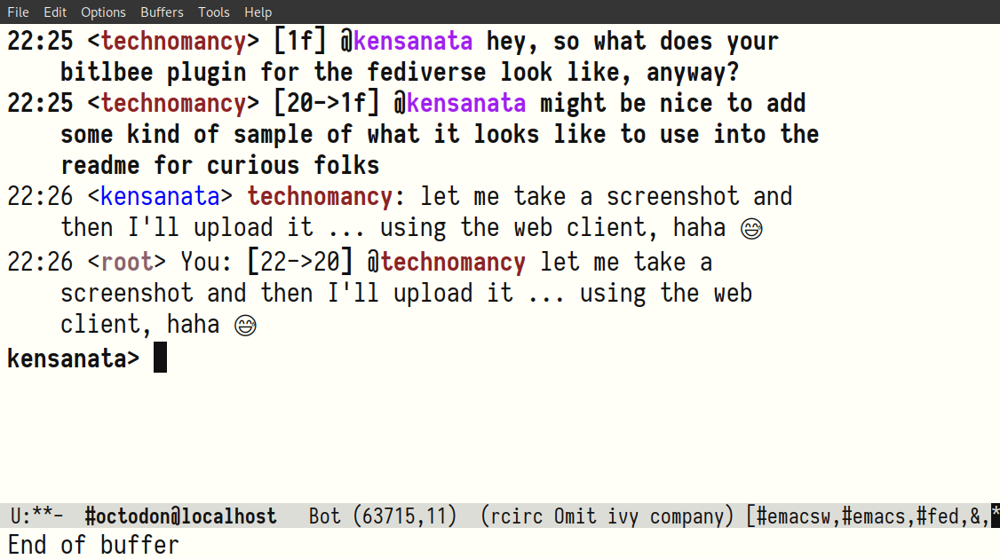

Mastodon plugin for Bitlbee
===========================

This plugin allows [Bitlbee](https://www.bitlbee.org/) to communicate
with [Mastodon](https://joinmastodon.org/) instances. Mastodon is a
free, open-source, decentralized microblogging network. Bitlbee is an
IRC server connecting to various other text messaging services. You
run Bitlbee and connect to it using an IRC client, then configure
Bitlbee to connect to other services, such as a Mastodon instance
where you already have an account. The benefit is that you can now use
[any IRC client](https://en.wikipedia.org/wiki/Comparison_of_Internet_Relay_Chat_clients)
you want to connect to Mastodon.



Please report issues using the
[Software Wiki](https://alexschroeder.ch/software/Bitlbee_Mastodon).
For questions, ping **kensanata** on `irc.oftc.net/#bitlbee`.

<!-- markdown-toc start - Don't edit this section. Run M-x markdown-toc-refresh-toc -->
**Table of Contents**

- [License](#license)
- [Usage](#usage)
- [Build dependencies](#build-dependencies)
- [Building and Installing](#building-and-installing)
- [Bugs](#bugs)
- [Debugging](#debugging)

<!-- markdown-toc end -->

License
-------

Most of the source code is distributed under the
[GNU Lesser Public License 2.1](https://www.gnu.org/licenses/old-licenses/lgpl-2.1.html#SEC1).

The build system is distributed under the 
[GNU Public License 2.0 or any later version](https://www.gnu.org/licenses/old-licenses/gpl-2.0.en.html#SEC1).

Anything without an obvious license in the file header also uses the
GPL 2.0 or any later version.


Contributors
------------

* [velartrill](http://github.com/velartrill) <lexi@hale.su>

Usage
-----

First, make sure the installation worked by checking the installed
protocols using the `plugins` command in your `&bitlbee` control
channel.

If this worked, create your account using the `account` command in
your `&bitlbee` control channel.

In this example, we'll sign in as
**@kensanata@mastodon.weaponvsac.space**. This assumes an existing
account on an instance! Replace username and Mastodon server when
trying it.

In your **&bitlbee** channel, add a new account, change it's
**base_url** to point at your instance, and switch it on:

> **&lt;kensanata&gt;** account add mastodon kensanata@mastodon.weaponvsac.space
> **&lt;root&gt;** Account successfully added with tag mastodon  
> **&lt;kensanata&gt;** account mastodon on  
> **&lt;root&gt;** mastodon - Logging in: Login  
> **&lt;root&gt;** mastodon - Logging in: Parsing application registration response  
> **&lt;root&gt;** mastodon - Logging in: Starting OAuth authentication  

At this point, you'll get contacted by the user **mastodon_oauth**
with a big URL that you need to visit using a browser. Visit the URL
and authenticate the client. You'll get back another very long string.
Copy and paste this string:

> **&lt;mastodon_oauth&gt;** Open this URL in your browser to authenticate: https://.......  
> **&lt;mastodon_oauth&gt;** Respond to this message with the returned authorization token.  
> **&lt;kensanata&gt;** \*\*\*\*\*\*\*\*\*\*\*\*\*\*\*\*\*\*\*\*\*\*\*\*\*\*\*\*\*\*\*\*\*\*\*\*\*\*\*\*\*\*\*\*\*\*\*\*\*\*\*\*\*\*\*\*\*\*\*\*\*\*\*\*  

Once you do that, your login should complete in the **&bitlbee** channel:

> **&lt;root&gt;** mastodon2 - Logging in: Requesting OAuth access token  
> **&lt;root&gt;** mastodon2 - Logging in: Connecting  
> **&lt;root&gt;** mastodon2 - Logging in: Verifying credentials  
> **&lt;root&gt;** mastodon2 - Logging in: Getting home timeline  
> **&lt;root&gt;** mastodon2 - Logging in: Logged in  

You should now have a channel called
**#mastodon.weaponsvsac.space@localhost** where all the status updates
and notifications get shown. We'll call this your **account channel**.
See **help set name** to change it's name.

Mastodon gives BitlBee a permanent authentication token, which is saved in your configuration.

You should probably save this configuration.

> **&lt;kensanata&gt;** save  
> **&lt;root&gt;** Configuration saved  

Adding the account and switching it on loads the Bitlbee Mastodon help
file into the system, allowing you to use `help mastodon` in your
`&bitlbee` control channel.

Alternatively, a snapshot of the entries added to the help system by
this plugin are available on the
[help page](https://alexschroeder.ch/cgit/bitlbee-mastodon/tree/doc/HELP.md#top).

Build dependencies
------------------

- `bitlbee` and headers >= 3.5

  If you haven't built Bitlbee yourself you will need to install the
  dev package, usually `bitlbee-dev` or `bitlbee-devel`. If Bitlbee
  was built from source don't forget to do `make install-dev`.
  
  To NetBSD users: your Bitlbee doesn't include the devel files.
  One way to fix this is to build Bitlbee via `pkgsrc`. You'll need
  to add to the `chat/bitlbee` pkgsrc `Makefile`, in the `post-build`
  hook, this line: 
 
  ```
  cd ${WRKSRC} && ${GMAKE} DESTDIR=${DESTDIR} install-dev
  ```
  
  Don't forget to regenerate your `PLIST` (`plugindir` is 
  `/usr/pkg/lib/bitlbee`) with:
  
  ```
  make print-PLIST > PLIST
  ```
  
- `glib2` and headers => 2.32

  The library itself is usually installed as a dependency of Bitlbee
  but headers need to be installed separately. In Debian, the package
  containing them is `libglib2.0-dev`.

- `autotools` (if building from git)

  A bit of an overkill, but it works. If you don't have this package,
  try looking for `autoconf` and `libtool`.
  
  \*BSD users should install `autoconf`, `automake` and `libtool`, 
  preferably the latest version available. FreeBSD will also need 
  `pkgconfig` on top of that. GNU `sed` (gsed), GNU `make` (gmake), and the `bash` shell are also required -- BSD `make` cannot successfully build bitlbee-mastodon, and the build process uses GNU extensions to both the Bourne shell and `sed`.


Building and Installing
-----------------------

Check your distribution:

- FreeBSD: `irc/bitlbee-mastodon`

Alternatively, build it from source. You need to generate the
autotools configuration script and related files by executing the
following command:

```
./autogen.sh
```

After that, you can build as usual:

```
./configure
make
sudo make install
```

🔥 If your Bitlbee's plugindir is in a non-standard location you need to
specify it: `./configure with --with-plugindir=/path/to/plugindir`

🔥 If you're installing this plugin in a system where you didn't build
your own Bitlbee but installed revision 3.5.1 (e.g. on a Debian system
around the end of 2017), you will run into a problem: the plugin will
get installed into `/usr/lib/bitlbee` (`plugindir`) but the
documentation wants to install into `/usr/local/share/bitlbee` instead
of `/usr/share/bitlbee` (`datadir`). As you can tell from
`/usr/lib/pkgconfig/bitlbee.pc`, there is no `datadir` for you. In
this situation, try `./configure --prefix=/usr` and build and install
again.

Bugs
----

🔥 [Crashing while running Twitter](https://alexschroeder.ch/software/Crashing_while_running_Twitter):
there seems to be some sort of interaction between the Twitter code
and the Mastodon plugin. If you get connected to Mastodon and then
Bitlbee crashes, and you have a Twitter account set up, try this:

1. take the Twitter account offline
2. take the Mastodon account online
3. take the Twitter account online

🔥 [Cannot use Pleroma](https://alexschroeder.ch/software/Support_Websockets_for_Streaming):
there are two ways to do streaming for Mastodon: regular long-running
HTTP requests, or a bunch of websockets that provides all the
streaming info. Sadly, the Mastodon plugin only supports HTTP streaming
and Pleroma only supports websockets. But we're [working on it](https://github.com/kensanata/bitlbee-mastodon/pull/43).

🔥 **No support for 2FA**: the Mastodon plugin knows about OAuth,
which means it doesn't ask you for the password of your Mastodon
account. Instead, it gives you an URL on your instance where you
identify yourself and get back a token which you then give the
Mastodon plugin. You can revoke this token from your instance by going
to Preferences → Account → Authorized Apps and looking for Bitlbee.
Sadly, the Mastodon plugin doesn't know about 2FA (two-factor auth).

Debugging
---------

Before debugging Bitlbee, you probably need to stop the system from
running Bitlbee. I'm still unsure of how to do it. The following seems
to do it:

```
sudo systemctl stop bitlbee
sudo killall bitlbee
```

You can enable extra debug output for `bitlbee-mastodon` by setting
the `BITLBEE_DEBUG` environment variable. This will print all traffic
it exchanges with Mastodon servers to STDOUT and there is a lot of it.
You can see this output in the systemd journal:

```
sudo journalctl -fu bitlbee
```

Alternatively, run `bitlbee` in foreground mode:

```
BITLBEE_DEBUG=1 bitlbee -nvD
```

If you run this as a normal use, bitlbee cannot read its config file
and thus won't know about your existing accounts. If you need to read
your config file from the standard location, run it as the bitlbee
user:

```
BITLBEE_DEBUG=1 sudo -u bitlbee bitlbee -nvD
```

If you need to use a debugger, make a copy of
`/etc/bitlbee/bitlbee.conf` (or simply create an empty file) and
`/var/lib/bitlbee/`. Then run `gdb`, set the breakpoints you want
(answer yes to "Make breakpoint pending on future shared library
load?"), and run it using the options shown:

```
touch bitlbee.conf
sudo cp /var/lib/bitlbee/*.xml .
gdb bitlbee
b mastodon_post_message
y
run -nvD -c bitlbee.conf -d .
```

Then connect with an IRC client as you usually do.

If you're getting error messages about the address being in use, you
haven't managed to kill the existing Bitlbee.

```
Error: bind: Address already in use
```

Check who's listening on port 6667:

```
sudo lsof -i:6667
```

Then do what is necessary to kill it. 😈

Note that perhaps you must remove the `-O2` from `CFLAGS` in the
`src/Makefile` and run `make clean && make && sudo make install` in
the `src` directory in order to build and install the module without
any compiler optimisation. If you run `make` in the top directory,
`src/Makefile` will get regenerated and you'll get your optimized code
again.

You know you're running optimized code when things seem to repeat
themselves in strange ways:

```
(gdb) n
594		if (!mastodon_length_check(ic, message)) {
(gdb) 
583	{
(gdb) 
594		if (!mastodon_length_check(ic, message)) {
(gdb) 
584		struct mastodon_data *md = ic->proto_data;
(gdb) 
594		if (!mastodon_length_check(ic, message)) {
(gdb) 
584		struct mastodon_data *md = ic->proto_data;
(gdb) 
594		if (!mastodon_length_check(ic, message)) {
(gdb) 
```

Or when values can't be printed:

```
(gdb) p m->str
value has been optimized out
```

WARNING: there *is* sensitive information in this debug output, such
as auth tokens, your plaintext password and, obviously, your incoming
and outgoing messages. Be sure to remove any information you are not
willing to share before posting it anywhere.

If you are experiencing crashes please refer to
[debugging crashes](https://wiki.bitlbee.org/DebuggingCrashes)
for information on how to get a meaningful backtrace.
